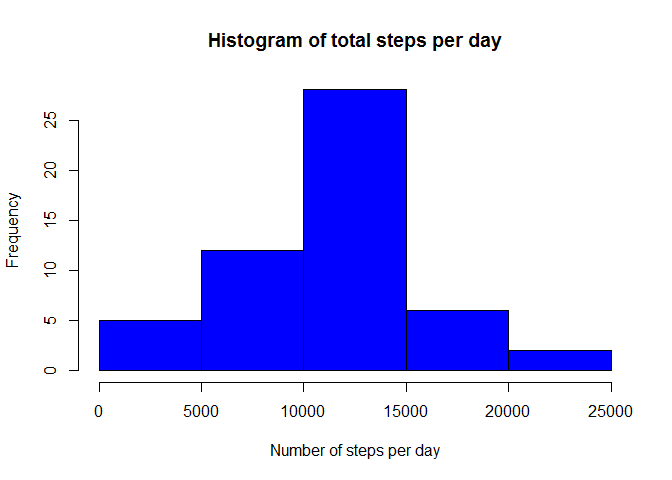
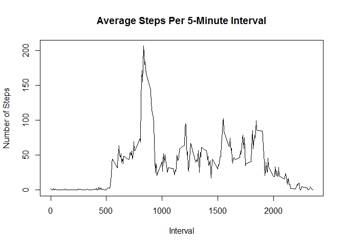
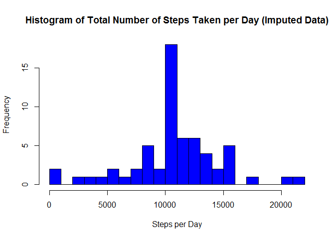
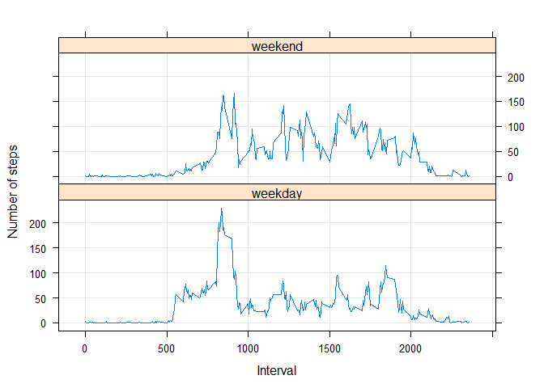

# Peer Assessment 1 - Reproducable Research

Assignement 1
https://github.com/coursera-jm/RepData_PeerAssessment1

## Loading and preprocessing the data

Read in the data.

```r
# Define some options for knitr
knitr::opts_chunk$set(tidy=FALSE, fig.path='figures/')
# cleanup
rm(list=ls())
#read the csv file
rfile <- read.csv('activity.csv')
dim(rfile)
```

```
## [1] 17568     3
```

```r
head(rfile)
```

```
##   steps       date interval
## 1    NA 2012-10-01        0
## 2    NA 2012-10-01        5
## 3    NA 2012-10-01       10
## 4    NA 2012-10-01       15
## 5    NA 2012-10-01       20
## 6    NA 2012-10-01       25
```

```r
str(rfile)
```

```
## 'data.frame':	17568 obs. of  3 variables:
##  $ steps   : int  NA NA NA NA NA NA NA NA NA NA ...
##  $ date    : Factor w/ 61 levels "2012-10-01","2012-10-02",..: 1 1 1 1 1 1 1 1 1 1 ...
##  $ interval: int  0 5 10 15 20 25 30 35 40 45 ...
```
## What is mean total number of steps taken per day?
1. Calculate the total number of steps taken per day

```r
total_of_steps_per_day <- sum(rfile$steps, na.rm = TRUE)
total_steps_each_day <- aggregate(formula=steps~date, 
                                  data=rfile, 
                                  FUN=sum, 
                                  na.rm=TRUE)
```
2. Generating the Histogram by each day

```r
hist(total_steps_each_day$steps,
     col = "blue",
     main = "Histogram of total steps per day",
     xlab = "Number of steps per day")
```

 
3. Calculate and report the mean and median of the total number of steps taken per day

```r
mean(total_steps_each_day$steps)
```

```
## [1] 10766.19
```

```r
median(total_steps_each_day$steps) 
```

```
## [1] 10765
```
## What is the average daily activity pattern?
1. Make a time series plot (i.e. type = "l") of the 5-minute interval (x-axis) and the average number of steps taken, averaged across all days (y-axis)

```r
five_min_avg <- aggregate(formula=steps~interval, 
                          data=rfile, 
                          FUN=mean, 
                          na.rm=TRUE)
plot(x=five_min_avg$interval,
     y=five_min_avg$steps,
     type="l",
     main="Average Steps Per 5-Minute Interval",
     xlab="Interval",
     ylab="Number of Steps")
```

 
2. Which 5-minute interval, on average across all the days in the dataset, contains the maximum number of steps?


```r
intv <-five_min_avg$interval[which.max(five_min_avg$steps)]
intv # maximum interval
```

```
## [1] 835
```
## Imputing missing values
1. Calculate and report the total number of missing values in the dataset 

```r
missing <- sum(is.na(rfile))
missing
```

```
## [1] 2304
```
2. Devise a strategy for filling in all of the missing values in the dataset. The strategy does not need to be sophisticated. For example, you could use the mean/median for that day, or the mean for that 5-minute interval, etc.

```r
library(plyr)
```

```
## Warning: package 'plyr' was built under R version 3.1.3
```

```r
mean_imput <- function(x) replace(x, is.na(x), mean(x, na.rm = TRUE))
rfile_impute <- ddply(rfile, ~interval, transform, steps = mean_imput(steps))
```
The following data set contains the sample data aggregated by date.

```r
rfile_impute.date <- aggregate(rfile_impute[1],
                               by=rfile_impute[2],
                               FUN=sum,
                               na.rm=TRUE)
hist(rfile_impute.date$steps,
     breaks=20,
     col = "blue",
     main = "Histogram of Total Number of Steps Taken per Day (Imputed Data)",
     xlab = "Steps per Day")
```

 

```r
mean(rfile_impute.date$steps)   # mean
```

```
## [1] 10766.19
```

```r
median(rfile_impute.date$steps) # median
```

```
## [1] 10766.19
```

## Are there differences in activity patterns between weekdays and weekends?

```r
rfile_impute$day <- "weekday"
rfile_impute$day[weekdays(as.Date(rfile_impute$date), abb=T) %in% c("Sat","Sun")] <- "weekend"
table(rfile_impute$day)
```

```
## 
## weekday weekend 
##   12960    4608
```

```r
library(lattice)
```

```
## Warning: package 'lattice' was built under R version 3.1.3
```

```r
mean_miss_day <- aggregate(steps~interval + day, 
                           data=rfile_impute, 
                           FUN="mean")
xyplot(steps ~ interval | day, 
       data=mean_miss_day, 
       type="l", 
       grid=T, 
       layout=c(1,2), 
       ylab="Number of steps", 
       xlab="Interval")
```

 


